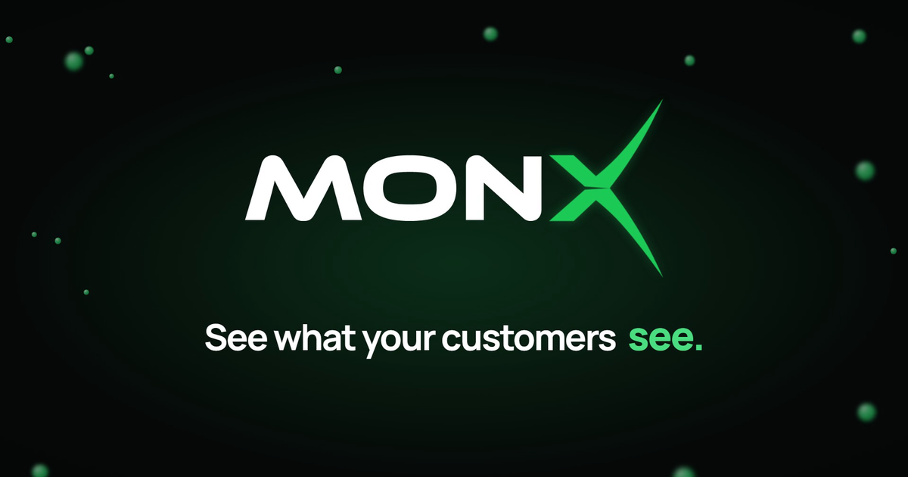

# MonX Website

Bilingual (English / Serbian) marketing site for **MonX**, a business-service monitoring product that tracks what customers actually do (card payments, logins, transfers per minute) instead of server health. It is written for operations and IT leaders at banks and payment companies.

**Live demo:** https://v0-saa-s-landing-page-jet-eta.vercel.app




## Overview

MonX's pitch is easy to say and hard to show: component monitoring can report "all green" while customers can't pay. This site makes that argument visually. It runs from the problem through the cost of downtime, how MonX works, the product itself, regulatory compliance (NBS Decision 102/2024, DORA) and a pilot offer. The product screens are coded as SVG/React mockups, not screenshots, so they stay sharp, animate, and translate along with the rest of the page.

## Key features

- **Two complete locales:** English at `/` and Serbian at `/sr`. Each has its own root layout, so every page gets the correct `<html lang>`, plus `hreflang` alternates and canonical URLs.
- **Animated storytelling sections:** a "payments drop" counter that falls from 2,847/min to zero while every component stays "OK", a live-ticking hero metric card, and scroll-triggered reveals.
- **Coded product mockups:** dashboards, anomaly bands, correlated metrics, incident records, an assistant chat and grouped alerts, built as React components with generated chart data (`components/mocks/`).
- **Tabbed product tour and cost breakdown** built on Radix Tabs, plus an FAQ on Radix Accordion.
- **"Book a demo" flow:** a Radix Dialog form posts to a Next.js API route, which sends the request by SMTP through Nodemailer.
- **Product video page** (`/pitch`): a standalone, `noindex` page with the 90-second product overview video, for sharing directly.
- **SEO:** Open Graph/Twitter metadata, generated `sitemap.xml` and `robots.txt`, and JSON-LD `SoftwareApplication` and `FAQPage` structured data built from the same copy as the page.
- **Branded 404** for any unknown route.

## Tech stack

| Area | Tools |
| --- | --- |
| Frontend | Next.js 14 (App Router), React 18, TypeScript |
| Styling | Tailwind CSS v4, `tw-animate-css`, IBM Plex Sans / Plex Mono + Space Grotesk via `next/font` |
| UI primitives | Radix UI (Dialog, Tabs, Accordion), lucide-react icons |
| Motion | Framer Motion (`whileInView`, `animate`, `useReducedMotion`) |
| Backend | Next.js Route Handler + Nodemailer (SMTP) |
| Deployment | Vercel (a plain Node server, `server.js`, is included for self-hosting) |

## Technical highlights

- **Typed i18n with no library.** All copy lives in `lib/i18n/en.ts` and `lib/i18n/sr.ts`. The English dictionary's type (`Dict`) is the contract the Serbian file has to satisfy, so a missing translation is a type error. Each section receives only its slice of the dictionary (`t.hero`, `t.problem`, ...).
- **Deterministic chart data.** `lib/series.ts` uses a seeded PRNG (mulberry32-style) to generate "daily-shaped" traffic curves, then draws them as smooth Catmull-Rom/Bézier SVG paths. The server and browser produce identical lines, so the mockups hydrate without mismatches and without a charting library.
- **Accessibility-aware motion.** Every animation checks `useReducedMotion()`: animated counters jump straight to their final state and reveals are skipped. A `<noscript>` style rule shows content that would otherwise wait for JavaScript to fade in.
- **Hardened contact endpoint.** `app/api/book-demo/route.js` checks a honeypot field (bots get a fake success), validates the email, trims and length-limits every field, and HTML-escapes all user input before it goes into the email body. The visitor's address is set as `replyTo`.
- **One page component, two languages.** `components/site/home-page.tsx` composes 14 sections and takes the dictionary as a prop, so the English and Serbian routes share all markup.

## Getting started

**Prerequisites:** Node.js 18.17+ and npm.

```bash
npm install
npm run dev        # http://localhost:3000
```

Other scripts:

```bash
npm run build      # production build
npm run start      # serve the production build
```

### Environment variables

Only the demo-request form needs configuration. Create `.env.local` with:

| Variable | Purpose |
| --- | --- |
| `SMTP_HOST` | SMTP server host |
| `SMTP_PORT` | SMTP port (the transport is configured with `secure: true`, i.e. port 465) |
| `SMTP_USER` | SMTP username, also used as the sender address |
| `SMTP_PASS` | SMTP password |
| `TARGET_EMAILS` | Comma-separated list of addresses that receive demo requests |

The site renders fine without these; only form submissions will fail.

## Project structure

```
app/
  (en)/             English root layout, home page, /pitch video page, 404
  sr/               Serbian root layout and home page
  api/book-demo/    Demo-request endpoint (Nodemailer)
  sitemap.ts, robots.ts, opengraph-image.png
components/
  sections/         Page sections (hero, problem, cost, product, compliance, pilot, FAQ, ...)
  mocks/            Coded product UI mockups and the hero chart
  site/             Header, footer, contact dialog, page composition
  ui/               Logo, button/section primitives, Reveal animation wrapper
lib/
  i18n/             en.ts / sr.ts copy dictionaries
  series.ts         Seeded data generator and SVG path helpers
public/             Logos and the product overview video
```

## Author

Lazar Gošić — GitHub [@lakygosh](https://github.com/lakygosh)
